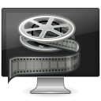

======
looker
======

:program: looker

:author: Brüggemann Eddie <mrcyberfighter@gmail.com>

:version: 1.0

:release: 2017/11/02

---

``looker`` is a video player with all the basic functionalities of a video player:

+ Play/Pause.

+ Chapter forward.

+ Chapter backward.

+ Fullscreen/Unfullscreen.

+ Time-line (with elapsed time and total duration).

+ Volume control.

+ Load a video file.

+ Make a snapshot.

---

But looker can remember the position of your video file when you close the player,

what permit you to reload the video, you watching at, at the position you stop it.

:note: In fact ``looker`` reload the video 1 minute before you the stop.

If you want, ``looker`` ask you at exit if he should store the position.

But you can disable this functionality into the preferences window.

The preferences window permit you to set looker as default player for the supported video formats:

+ \*.avi (video/avi).

+ \*.asf, \*.asx (video/x-ms-asf).

+ \*.mpeg, \*.mpg, \*.mpe (video/mpeg)

+ \*.qt, \*.mov (video/quicktime).

+ \*.ogv (video/ogg).

+ \*.ogx (application/ogg).

+ \*.wmv (video/x-ms-wmv).

+ \*.webm (video/webm).

+ \*.mpv, \*.mkv (video/x-matroska).

And ``looker`` permit you to reset the default settings.

---

``looker`` permit you to clear the file which store the position of your videos.

Because when ``looker`` ask you for registering if you answers:

+ "yes", it will store the position.

+ "No" it will delete the entry if it exists one for the video file.

And the file, which store the positions, will grow if you don't answers "No" at exit at the end of the video.

---

``looker`` permit you to select the folder where to store the snapshots:

+ Desktop (default).

+ Documents.

+ Download.

+ Music.

+ Picture.

+ Videos.

=========
Shortcuts
=========

  +------------+-------------+----------------------+
  |  Shortcut  |    Memo     | Functionality        |
  +============+=============+======================+
  | Ctrl + O   | Open        | Open file            |
  +------------+-------------+----------------------+
  | Ctrl + S   | Snapshot    | take a snapshot      |
  +------------+-------------+----------------------+
  | Ctrl + +   | None        | Increment volume     |
  +------------+-------------+----------------------+
  | Ctrl + -   | None        | Decrement volume     |
  +------------+-------------+----------------------+
  | Ctrl + C   | Clear       | Clear positions file |
  +------------+-------------+----------------------+
  | Ctrl + P   | Preferences | Preferences          |
  +------------+-------------+----------------------+
  | Ctrl + A   | About       | About window         |
  +------------+-------------+----------------------+
  | Escape     | Escape      | Quit application     |
  +------------+-------------+----------------------+      

=======
Credits
=======

Thanks to my beloved mother, my family and to the doctors.

Stay away from drugs: drugs destroy your brain and your life.

